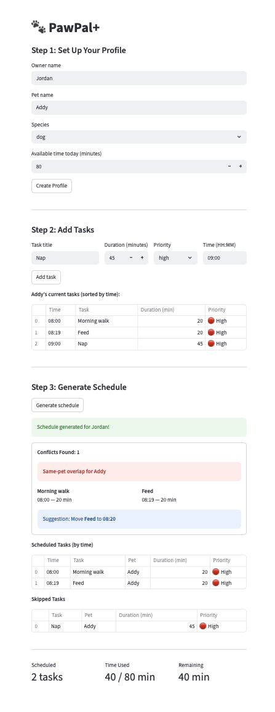

# PawPal+ (Module 2 Project)

You are building **PawPal+**, a Streamlit app that helps a pet owner plan care tasks for their pet.

## Scenario

A busy pet owner needs help staying consistent with pet care. They want an assistant that can:

- Track pet care tasks (walks, feeding, meds, enrichment, grooming, etc.)
- Consider constraints (time available, priority, owner preferences)
- Produce a daily plan and explain why it chose that plan

Your job is to design the system first (UML), then implement the logic in Python, then connect it to the Streamlit UI.

## What you will build

Your final app should:

- Let a user enter basic owner + pet info
- Let a user add/edit tasks (duration + priority at minimum)
- Generate a daily schedule/plan based on constraints and priorities
- Display the plan clearly (and ideally explain the reasoning)
- Include tests for the most important scheduling behaviors

## 📸 Demo



## Features

### Core
- **Multi-pet support** -- `Owner` manages a list of `Pet` objects; `Owner.get_all_tasks()` aggregates tasks across all pets into a single flat list for scheduling
- **Priority-based scheduling** -- `Scheduler.generate_plan()` sorts tasks using a greedy algorithm (HIGH=0, MEDIUM=1, LOW=2) and fills the owner's `available_minutes` budget top-down, recording a reasoning string for every schedule/skip decision
- **Time budget enforcement** -- `Scheduler.fits_in_budget()` compares each task's `duration_minutes` against `time_remaining` to decide inclusion; tasks that don't fit are added to `skipped_tasks` with an explanation

### Algorithms
- **Sorting by time** -- `Scheduler.sort_by_time()` converts each task's `scheduled_time` (`"HH:MM"`) to minutes since midnight via `_to_minutes()`, then sorts ascending with a lambda key. Returns a new list without modifying the original
- **Filtering by pet/status** -- `Scheduler.filter_tasks()` accepts optional `status` and `pet_name` parameters that combine with AND logic. Pet name matching is case-insensitive. Returns the original list unchanged if neither parameter is provided
- **Daily/weekly recurrence** -- `Task.mark_complete()` sets `status` to `"completed"`, then uses a `frequency_delta` lookup (`{"daily": timedelta(days=1), "weekly": timedelta(weeks=1)}`) to compute the next `scheduled_date`. Creates the next occurrence via `dataclasses.replace()` and auto-adds it to the same `Pet`. Tasks with `frequency="as needed"` simply complete with no follow-up
- **Conflict detection** -- `Scheduler.detect_conflicts()` compares every unique task pair using `_overlaps()`, which checks whether two tasks share the same `scheduled_date` and have overlapping time windows (`start_a < end_b and start_b < end_a`). Each conflict is classified as `"same_pet"` or `"cross_pet"`. A wrapper `detect_conflicts_warnings()` formats conflicts as plain English strings

### UI Integration
- **Chronological task table** -- `app.py` calls `sort_by_time()` to display tasks in time order as the user adds them
- **Conflict suggestions** -- the UI calculates `end_a` (end time of the first conflicting task) and suggests moving the second task to that time
- **Schedule summary** -- displays metrics for total tasks scheduled, time used vs. budget, and remaining minutes

## Smarter Scheduling

Beyond the basic priority-based planner, PawPal+ includes four algorithmic features:

- **Sort by time** -- `Scheduler.sort_by_time()` orders tasks chronologically by their `"HH:MM"` scheduled time using a lambda key that converts to minutes since midnight.
- **Filter by pet/status** -- `Scheduler.filter_tasks()` narrows a task list by completion status, pet name, or both (AND logic, case-insensitive).
- **Recurring tasks** -- `Task.mark_complete()` automatically generates the next occurrence for daily (+1 day) and weekly (+7 day) tasks using `timedelta`, while "as needed" tasks simply complete with no follow-up.
- **Conflict detection** -- `Scheduler.detect_conflicts()` compares every task pair for time-window overlaps and classifies each as `same_pet` or `cross_pet`. A lightweight `detect_conflicts_warnings()` wrapper returns plain English warnings safe to print directly.

## Testing PawPal+

Run the full test suite with:

```bash
python -m pytest test/test_pawpal.py -v
```

The suite includes 43 tests covering:

- **Sorting correctness** -- tasks are returned in chronological order by `scheduled_time`
- **Recurrence logic** -- marking a daily task complete creates a new task for the following day
- **Conflict detection** -- the Scheduler flags overlapping times as `same_pet` or `cross_pet`
- **Filtering** -- tasks can be narrowed by status, pet name, or both
- **Scheduling** -- high-priority tasks are scheduled first within the time budget

**Confidence Level:** 4/5 stars -- All 43 tests pass across happy paths and edge cases for every core feature. The one star held back is because the UI layer (app.py) is not yet covered by automated tests.

## How Agent Mode Was Used
Claude Code's Agent Mode was the primary tool for implementing the scheduling logic in `pawpal_system.py`. Rather than writing code manually and pasting it in, each feature was built through a directed conversation where I described what I wanted and the agent read, edited, and tested the files directly.

### Phase-by-phase workflow

1. **Review and analysis** -- I asked the agent to open `main.py` and `pawpal_system.py` and identify where the logic was manual or overly simple. It read both files, traced the data flow from `Owner` through `Scheduler.generate_plan()`, and produced a detailed list of gaps: unused fields (`frequency`, `special_needs`, `age`), dead methods (`is_high_priority`, `mark_complete`), and missing capabilities (no gap-filling, no conflict awareness). This audit shaped the feature list.

2. **Iterative feature implementation** -- I gave the agent one feature at a time with specific instructions:
   - *"Use a lambda function as a key to sort strings in HH:MM format"* -- the agent added `Task.scheduled_time` and `Scheduler.sort_by_time()`, choosing `_to_minutes()` as the sort key
   - *"Implement a method that filters tasks by completion status or pet name"* -- the agent recommended a single method with optional parameters over two separate methods, explaining the AND-logic composability tradeoff, then implemented `filter_tasks()`
   - *"Add logic so that when a daily or weekly task is marked completed, a new instance is automatically created"* -- the agent added `Task.scheduled_date`, imported `timedelta`, and rewrote `mark_complete()` to return the next occurrence
   - *"Detect if two tasks for the same pet or different pets are scheduled at the same time"* -- the agent built `_overlaps()`, `detect_conflicts()`, and `detect_conflicts_warnings()` as layered methods

3. **Testing in the terminal** -- After each feature, the agent updated `main.py` with deliberately out-of-order data, mixed frequencies, and intentional conflicts, then ran `python main.py` to verify output. Each test section is labeled (e.g., `TEST: sort_by_time`, `TEST: detect_conflicts`) so results are traceable.

4. **Code review and simplification** -- I asked the agent to evaluate whether each method could be simplified. It analyzed all 15 methods and concluded that 13 were already at the right complexity. It identified two genuine improvements: `sort_by_time()` was duplicating the `_to_minutes()` parsing logic (consistency issue), and `mark_complete()` was manually copying 7 fields instead of using `dataclasses.replace()` (maintainability issue). It applied only those two changes.

5. **Documentation** -- The agent added full docstrings (Args, Returns, Example) to all new methods, wrote the tradeoff analysis in `reflection.md`, and authored the Smarter Scheduling section of this README.

### What Agent Mode enabled
- **Read-before-write discipline** -- The agent always read the current file state before making edits, so changes were never based on stale assumptions
- **Targeted edits** -- Rather than rewriting entire files, the agent used precise string replacements that touched only the lines being changed
- **Immediate verification** -- After every edit, the agent ran the program and checked output, catching issues in the same step they were introduced
- **Opinionated recommendations** -- When asked "what do you think is better?", the agent gave a direct recommendation with reasoning (e.g., one filter method vs. two), rather than listing options without a stance

## Getting started

### Setup

```bash
python -m venv .venv
source .venv/bin/activate  # Windows: .venv\Scripts\activate
pip install -r requirements.txt
```

### Launch the App

```bash
streamlit run app.py
```

### Usage

#### Step 1: Create Your Profile
Enter your name, your pet's name and species, and how many minutes you have available today. Click **Create Profile** to save.

#### Step 2: Add Tasks
Add care tasks for your pet. Each task requires:
- **Title** -- what needs to be done (e.g., "Morning walk")
- **Duration** -- estimated time in minutes
- **Priority** -- low, medium, or high
- **Time** -- when the task should happen (`HH:MM` format)

Tasks are displayed in a table sorted by scheduled time.

#### Step 3: Generate Schedule
Click **Generate schedule** to produce your daily plan. The app will:
1. Sort tasks by priority (high first) and fit them within your time budget
2. Display scheduled tasks in chronological order
3. Flag any time conflicts between overlapping tasks
4. Show skipped tasks that didn't fit in the budget
5. Display a summary with total tasks scheduled, time used, and time remaining

## Architecture
PawPal+ is built around five core components:

- **`Priority`** -- Enum defining LOW, MEDIUM, HIGH priority levels
- **`Task`** -- Represents a single care task with time, priority, frequency, and status
- **`Pet`** -- Holds pet info and manages its own task list
- **`Owner`** -- Holds owner info, time budget, and a list of pets
- **`Scheduler`** -- Generates plans, detects conflicts, sorts, and filters tasks

### Relationships
- `Owner` owns many `Pet`s (1-to-many)
- `Pet` manages many `Task`s (1-to-many)
- `Scheduler` uses one `Owner` to access all pets and tasks

### Suggested workflow

1. Read the scenario carefully and identify requirements and edge cases.
2. Draft a UML diagram (classes, attributes, methods, relationships).
3. Convert UML into Python class stubs (no logic yet).
4. Implement scheduling logic in small increments.
5. Add tests to verify key behaviors.
6. Connect your logic to the Streamlit UI in `app.py`.
7. Refine UML so it matches what you actually built.
